## **SAP HANA Cloud**

- SAP HANA Cloud is a database as a service that powers mission-critical applications and real-time analytics with one solution at petabyte scale.

-  SAP Hana cloud is a complete database and application development platform. By Combining In-Menory storage with columnar store, data operations are performed faster than in a traditional database with a disk-based storage.

### **SAP HANA Database Deployment Infrastructure**
SAP HANA Deployment Infrastructure (HDI) provides a service that enables you to deploy database development artifacts to so-called containers.These containers store design-time artifacts and deployed run-time objects for the HANA platform database. They include tables, views, functions, and procedures.

### **Schema**
schema is a logical container that organizes database content into sub-databases.
Schemas can be named statically or dynamically. Dynamic schema names are generated when an HDI Container is first created in the system. 

### **Data Lake**
A data lake is a centralized repository designed to store, process, and secure large amounts of structured, semistructured, and unstructured data.

### **Connect SAP HANA cloud with CAP Application**
  Setup Steps in SAP HANA Cloud
- Go to SAP BTP Cockpit → Access the sub-account used for SAP HANA Cloud
- Go to "Instances and Subscriptions"
- Find the instance with Service "SAP HANA Cloud" and plan "hana" for the database instance that you want to connect.
- Select the row of the instance
- Go to tab "Service Keys"
- Click "Create"
- Enter a name for the service key
- Click "Create"

**STEP 1: In the SAP BTP Cockpit, click on your subaccount.**
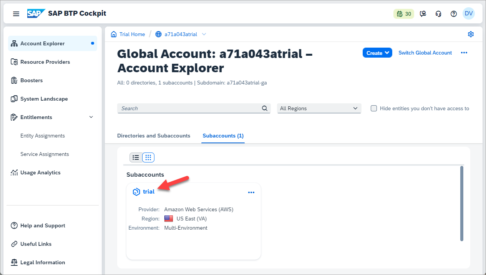

**STEP 2: Then click on Entitlements on the left-hand side menu and search for entitlements for SAP HANA.**
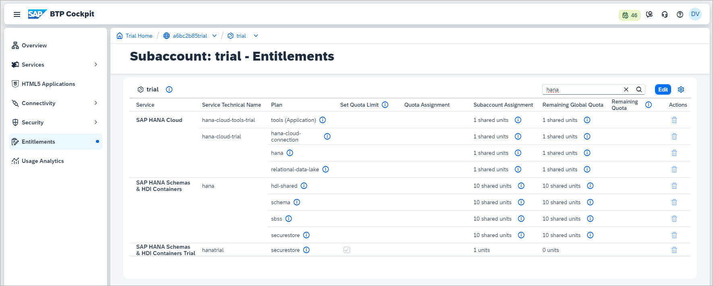 

**STEP 3: From SAP BTP Cockpit, click on Services and then Service Marketplace. Search for SAP HANA Cloud and click Create in the top-right corner.**
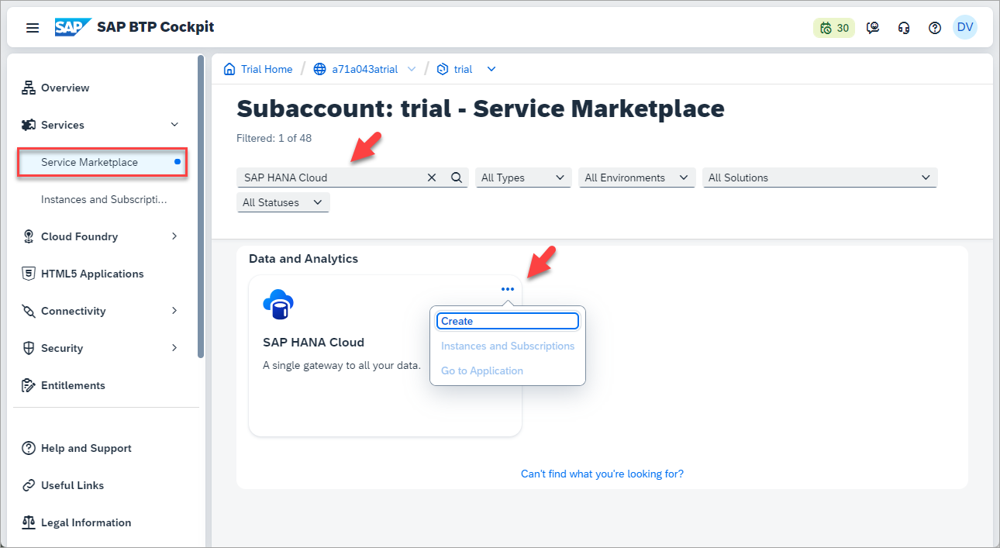

**STEP 4: Select SAP HANA Cloud under Service and tools under Plan.**
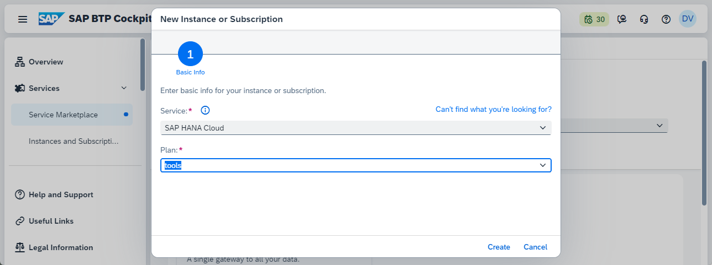 

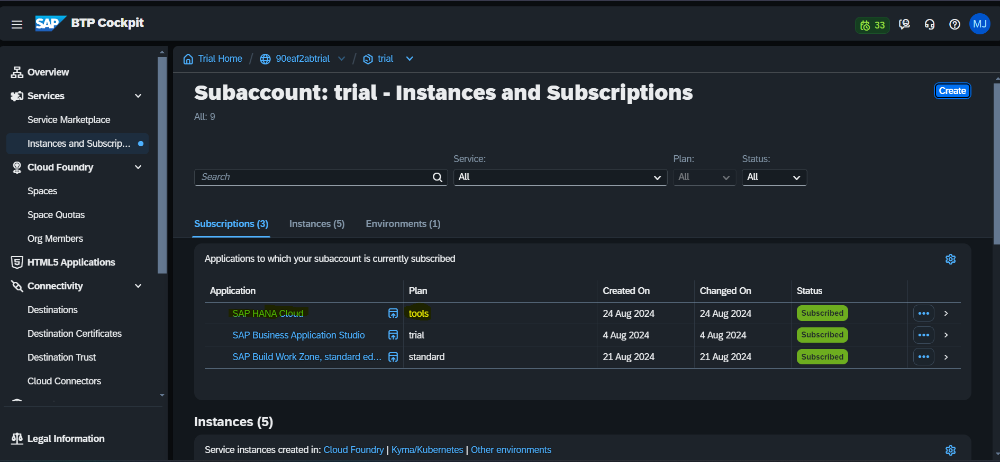

**STEP 5: To ensure that your desired user has the necessary permissions to manage instances in HANA Cloud Central, navigate to Security > Users in the left-hand side menu. Then click on your user.**
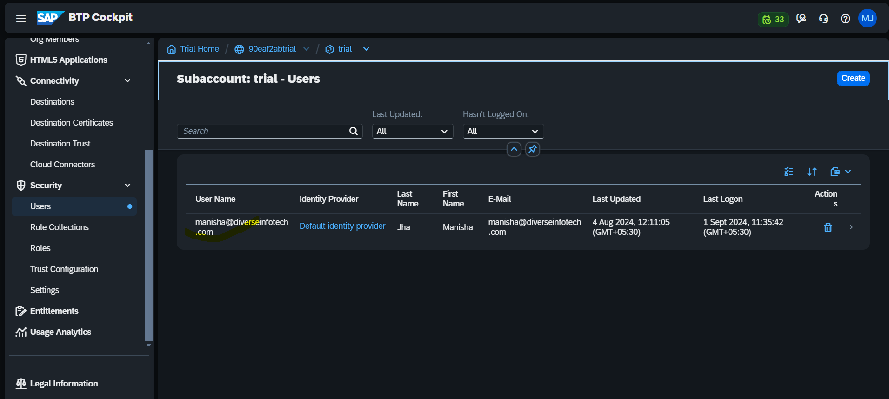 

**STEP 6: Click on the Assign Role Collection button & Select SAP HANA Cloud Administrator then click Assign Role Collection.**
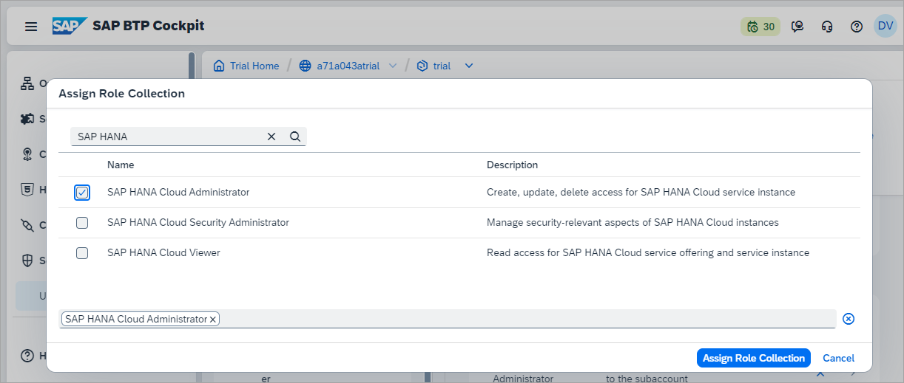 

**STEP 7: Here you must choose the Type of instance to create. Select SAP HANA Cloud, SAP HANA Database.**
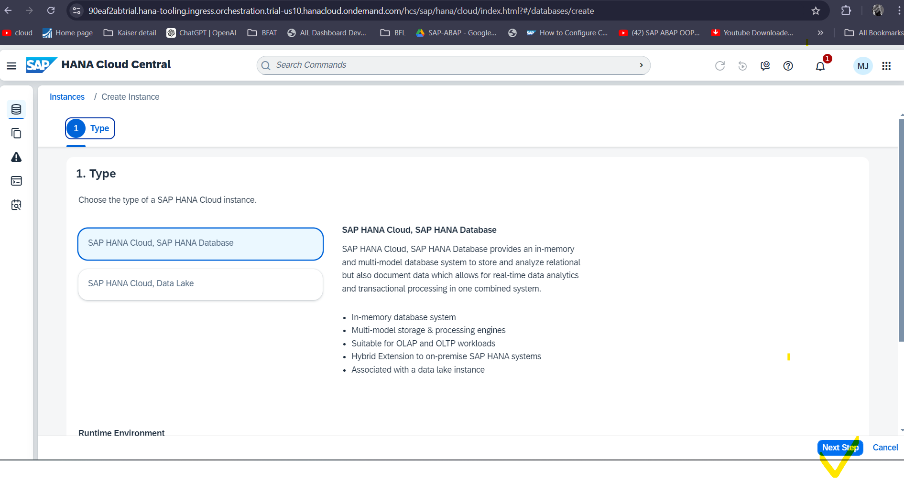 

**STEP 8: In the Basics section, enter a name for your instance in the field Instance Name, Insert a password in the Administrator Password field & Now click on Next STEP to continue.**
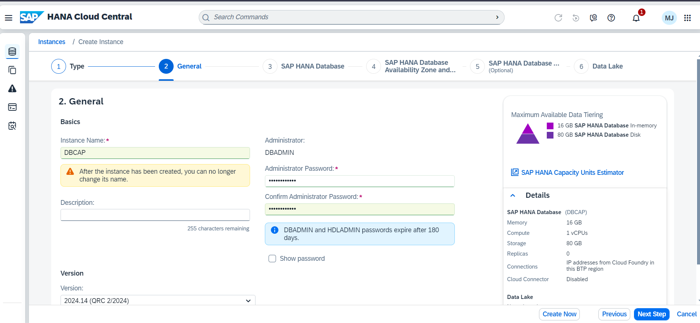

**STEP 9: Here, you can select how much Memory you wish to allocate to this instance**
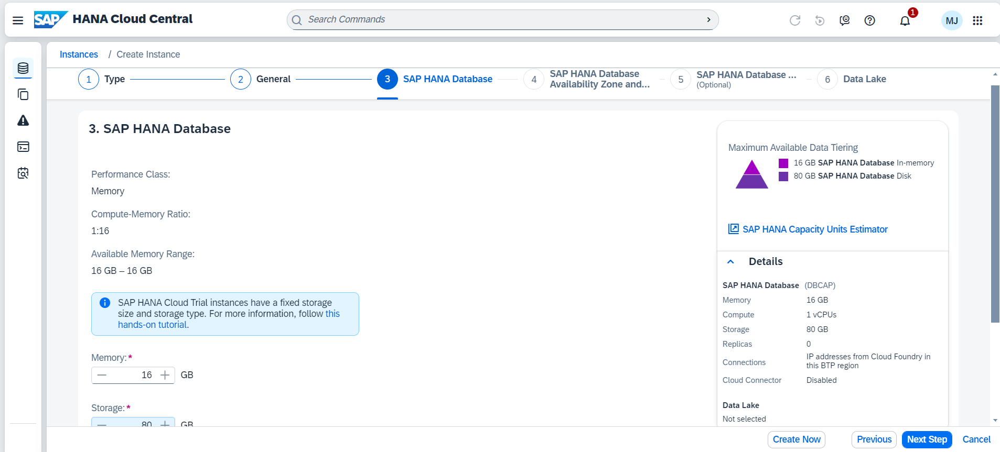 

**STEP 10: Select the availability zone for your instance and optionally, include a replica.**
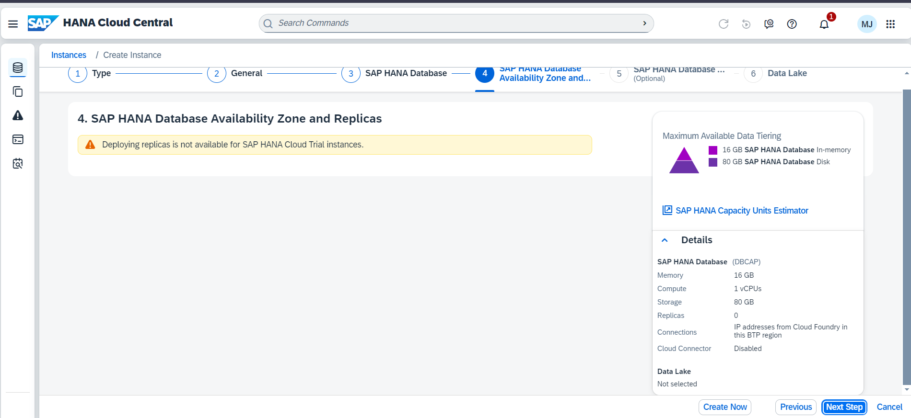 

**STEP 11: You can now manage the allowed connections for your SAP HANA database instance, i.e., you can choose to allow access to your SAP HANA database instance from outside of the SAP Business Technology Platform. You can either limit it to SAP Business Technology Platform by denying all IP addresses, or allow specific applications to access it by inserting one or more specific IP addresses. Finally, you can also allow all connections from all IP addresses.**

**Next, you can also choose to enable the SAP Cloud Connector, which makes it easier to connect this SAP HANA database instance to an SAP HANA on-premise database.**
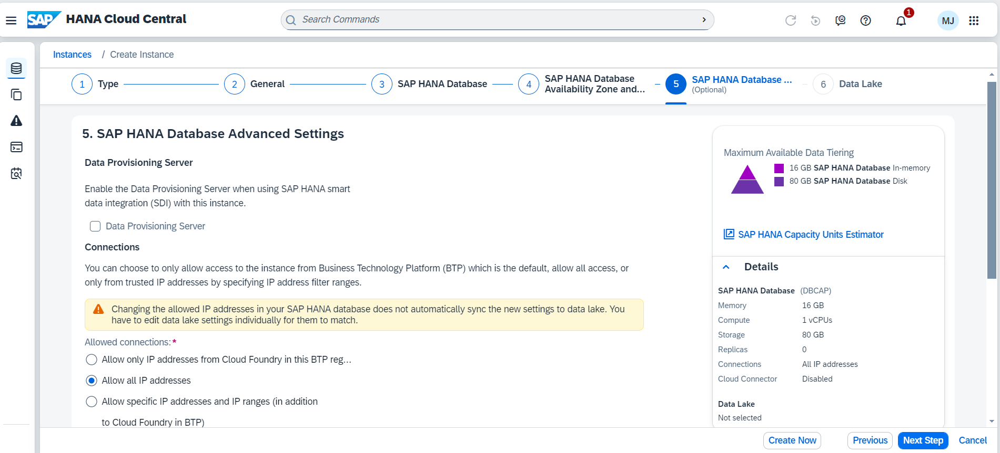 

**STEP 12: If you click on Create data lake, a managed SAP HANA Cloud, data lake will be provisioned alongside your SAP HANA database in SAP HANA Cloud.**
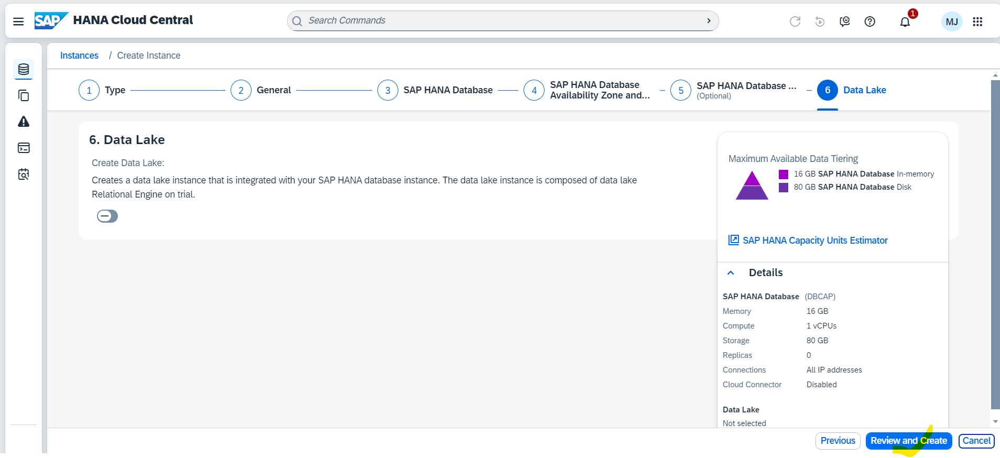

