## **SAP FIORI**
Sap Fiori is a new user experience (UX) for sap software and application. It provides a set of applications that are used in regular business functions like work approvals, financial apps and calculation apps etc…
                                      Sap Fiori enables multiple devices application that allows users to start a process on their desktop/laptop and to continue that process on a smartphone or on a tablet.
### **Design Principles**
The design philosophy of SAP Fiori is based on five core principles. SAP Fiori user experience is role-based, adaptive, simple, coherent, and delightful.

### **Type of Fiori app**
SAP Fiori has three app types, each distinguished by their focus and infrastructure requirements:
i> Transactional apps
ii> Fact sheets
iii> Analytical apps

### **SAP FIORI LAUNCHPAD :**
Launchpad is the single entry point for all business users.
http://<host>.<domain>:<port>/sap/bc/ui5_ui5/ui2/ushell/shells/abap/Fiorilaunchpad.html?sap-client=<client>&sap-language=EN

### **T-code:**
- /n/UI2/FLP- Launchpad
- /n/UI2/FLPD_CUST- Launchpad Designer

### **SAP FIORI LAUNCHPAD DESIGNER :**
The Fiori launchpad designer is a tool to configure the tiles for static and dynamic Fiori apps.

HTTP://<host>.<domain>:<port>/sap/bc/ui5_ui5/sap/arsrvc_upb_admn/main.html?sap-client=<client>?scope=CUST
HTTP://<host>.<domain>:<port>/sap/bc/ui5_ui5/sap/arsrvc_upb_admn/main.html?sap-client=<client>?scope=CONF

### **CATALOG :**
A catalog is a set of apps we want to make available for one role.
TWO WAYS OF SAP FIORI APPS IMPLEMENTATION :
- Standard Fiori apps
- Customized Fiori apps

### **GROUP:**
A group is a subset of Applications from one or more catalogs. 

### Standard Fiori apps
STEP 1 : **GO TO SAP REFERENCE LIBRARY**
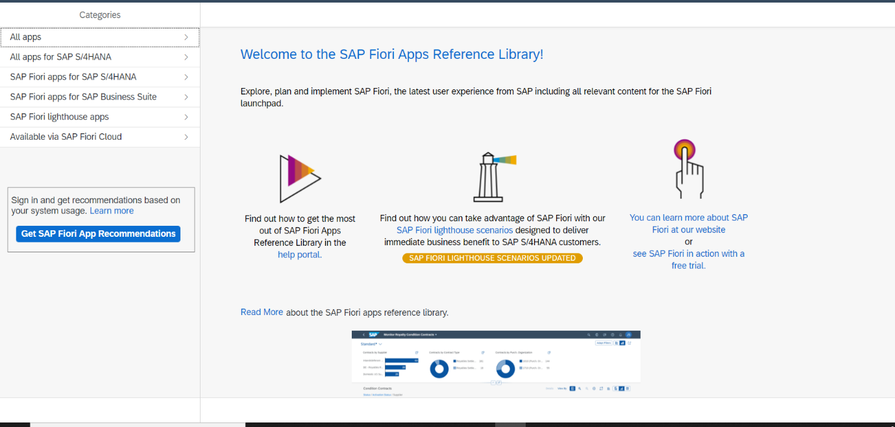

**STEP 2: CLICK ON ALL APPS FOR SAP S/4 HANA**
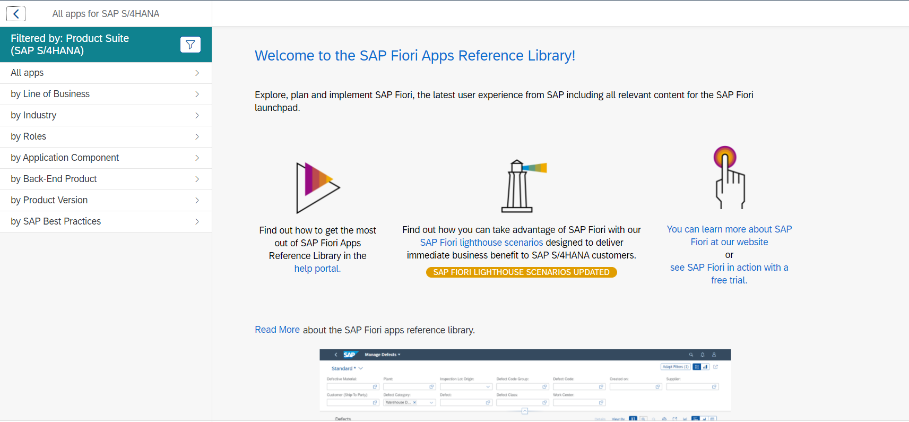

**STEP 3: CLICK ON ALL APPS**
**STEP 4: SEARCH FOR REQUIREED T-CODE**
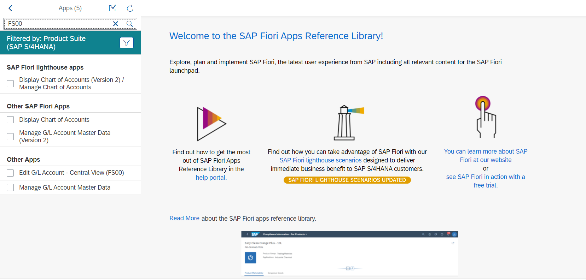
**STEP 5: GO TO IMPLEMENTATION INFORMATION AND CKECK THE SOFTWARE COMPONENT IN INSTALLATION**

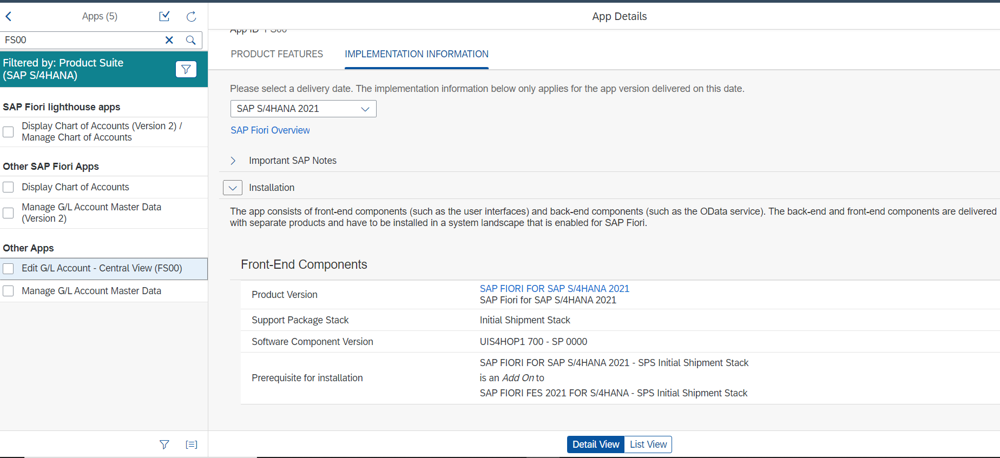
**STEP 6: LOG ON SAP GUI and goto system -> status-> product version where we check the software component is installed or not** 

**STEP 7:  IF SOFTWARE COMPONENT IS INSTALLED THEN COPY THE BUSSINESS CATALOG**
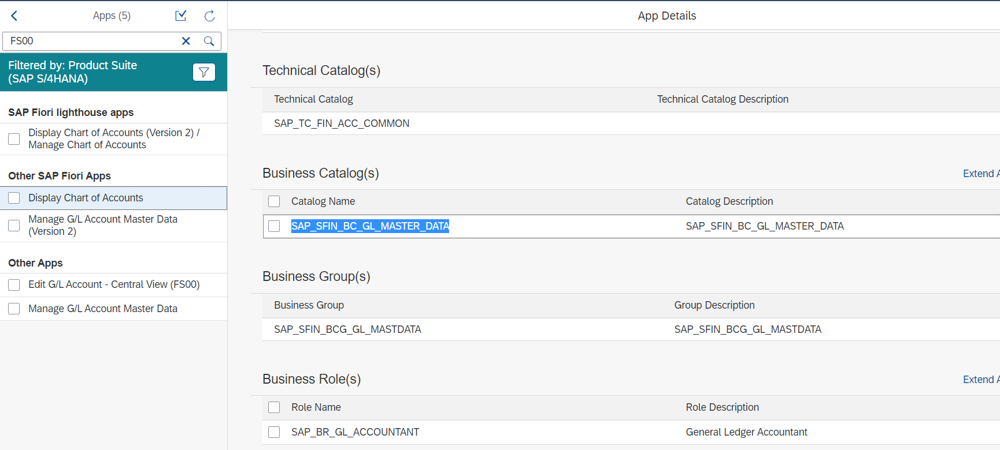

**STEP 8: LOG IN FIORI LAUNCHPAD DESIGNER AND PASTE THE BUSSINESS CATALOG**
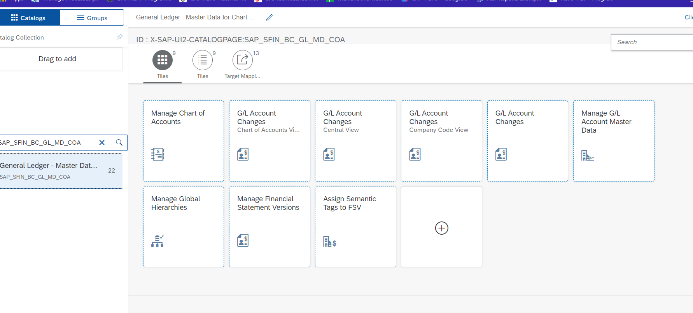

**STEP 9: FIND THE RIGHT ONE T-CODE APPS AND CREATE COPY WITH REFERENCE AND TARGET MAPPING ALSO**
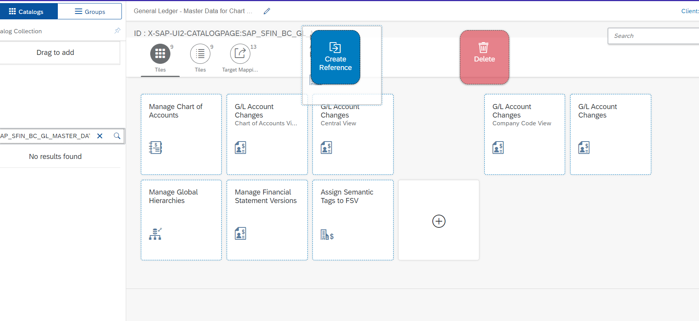
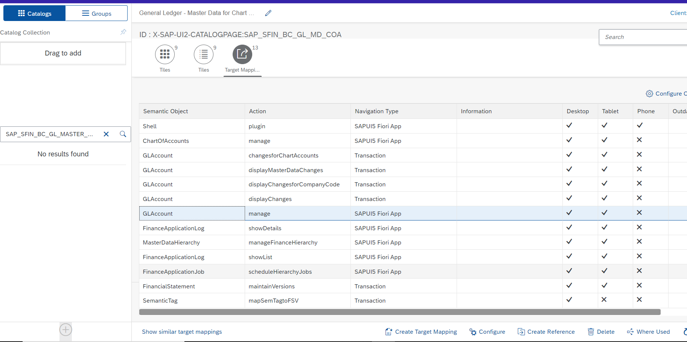
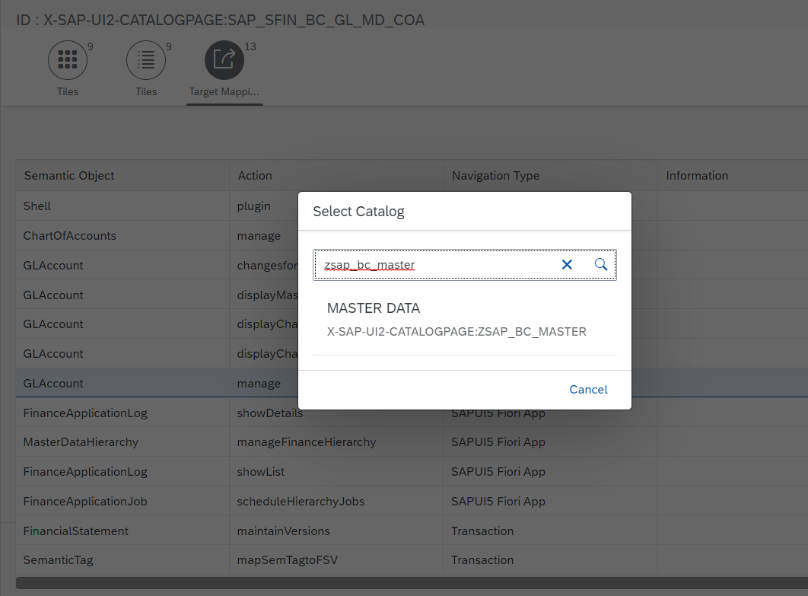

**STEP 10: CREATE a group and assign the catalog to this group**
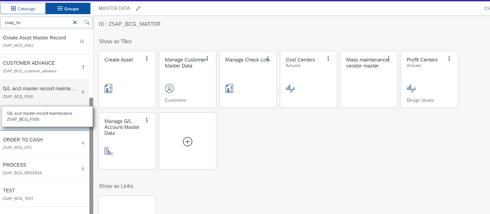
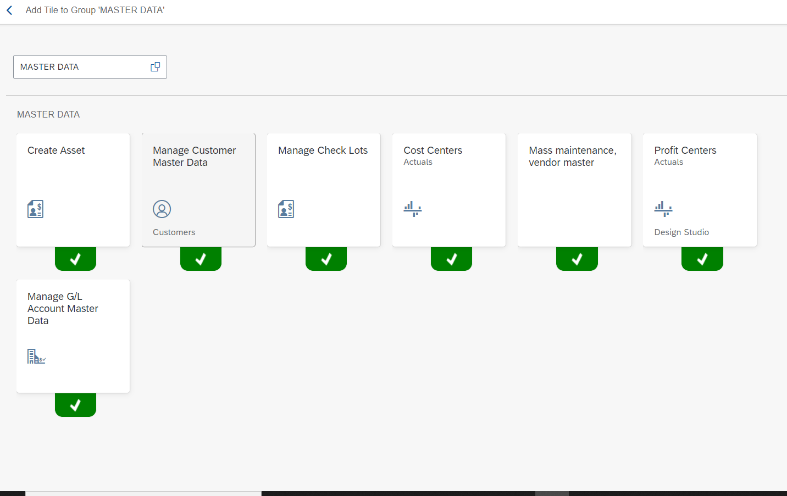

**Step 11: create a role to the user**
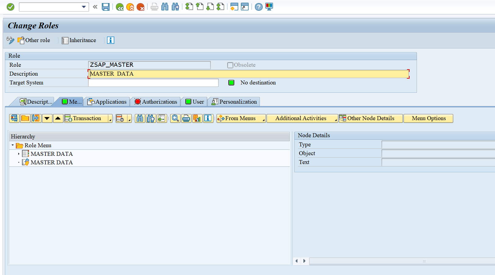
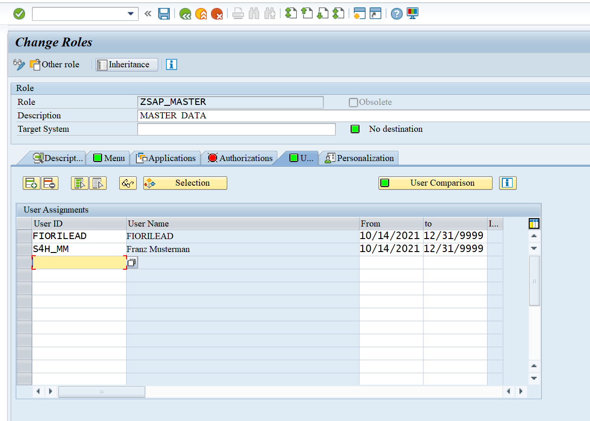

## **Semantic Object:**
IT Represents a business entity such as a customer, a sales order, or a product. Using semantic objects, you can bundle applications that reflect a specific scenario. They allow you to refer to objects in a standardized way, abstracting from concrete implementations of these objects. You can either use semantic objects shipped by SAP, or create new semantic objects.

## **TARGET MAPPING :**
Target mapping is part of the SAP Fiori launchpad configuration. It defines the target application, which is launched when clicking on a tile, on a link or within app-to-app navigation.

## **Intent:**
An intent is a unique combination of a semantic object (for example, Purchase Order) and an action (for example, Display) and an optional set of navigation parameters.

To summarize: When a user clicks a tile in their launchpad, the intent (including optional parameters) navigates to the app and opens it.

## **System Alias:**
An SAP system alias is needed as the logical name of a system connection, that is, you specify where the SAP system alias should point to. Depending on the Gateway content scenario and your system landscape you thus set up the system alias.

### SAP Fiori for SAP S/4HANA – Top 5 Fiori features that bring value to every Business User
* Fiori Enterprise Search
* Fiori Notifications
* Fiori Default Values
* Fiori Personalization
* User Assistance

## **Binding**

Element-binding allows the relative binding of all children with respect to a parent. Property binding is used to bind model data to the property of a control.
