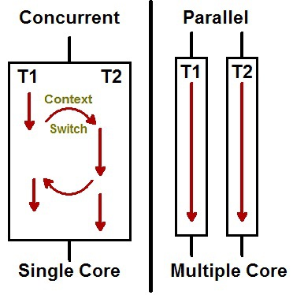

# Concurrency

## cpu bound vs IO bound process

- CPU bound: `calculation, if-else, for-loop, normal codes`
- IO bound: `network calls, read/write to files`

---

## Busy waitng

- waiting for something, rather than doing something useful
- wastes cpu cycles

---

## concurrency vs parallelism

- Concurrency: **one person** switches between different tasks 
- Parallelism: **multiple people** work on different tasks

- **Context switching**: Context switching is when we shift our attention between different tasks, apps, or projects
> In cpu terms, switching from one process/task to another.

> people = cpu (cores)

---

## Race condition (`critical section`)

- a **critical section** refers to a segment of code that is executed by multiple concurrent threads or processes, and which accesses shared resources

> Resource: variables, files, etc.

---

## Mutual Exclusion (`Mutex`)

---

## Deadlock

A deadlock is a situation in which two computer programs sharing the same resource are effectively preventing each other from accessing the resource, resulting in both programs ceasing to function.
