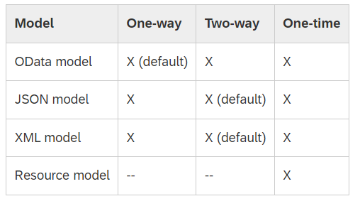

### Types of Model:
**OData model:**

Enables binding of controls to data from OData services. The OData model supports two-way (default), one-way and one-time binding modes. However, two-way binding is currently only supported for properties, and not for aggregations.

**JSON model**
The JSON model can be used to bind controls to JavaScript object data, which is usually serialized in the JSON format. The JSON model is a client-side model and, therefore, intended for small data sets, which are completely available on the client. The JSON model supports two-way (default), one-way and one-time binding modes.

```js

var oModel = new sap.ui.model.json.JSONModel();
oModel.setData({
    firstName: "Peter",
    lastName: "Pan"
});
```

To change the default binding mode, call the setDefaultBindingMode method on the model as follows:

```js

var oModel = new sap.ui.model.json.JSONModel();
oModel.setDefaultBindingMode(sap.ui.model.BindingMode.OneWay);

```
**XML model:**

A client-side model intended for small data sets, which are completely available on the client. The XML model does not contain mechanisms for server-based paging or loading of deltas. The XML model supports two-way (default), one-way and one-time binding modes.

**Resource model:**

Designed to handle data in resource bundles, mainly to provide texts in different languages. The resource model only supports one-time binding mode because it deals with static texts only.

---
Note:-

* The JSON model, XML model, and the resource model are client-side models, meaning that the model data is loaded completely and is available on the client. Operations such as sorting and filtering are executed on the client without further server requests.

* The OData model is a server-side model and only loads the data requested by the user interface from the server.

---
### Types of View:
* XML view
* JSON view
* JS view
* HTML view

### Binding Modes

* One Way: One-way binding means a binding from the model to the view; value changes in the model update all corresponding bindings and the view

* Two Way: Two-way binding means a binding from the model to the view and from the view to the model; value changes in the model and in the view update all corresponding bindings and the view and model, respectively

* One Time: One-time binding means from model to view once.



### Binding Types

* Element binding
* Property binding
* Aggregation binding

### Element binding

Element binding allows you to bind elements to a specific object in the model data, which will create a binding context and allow relative binding within the control and all of its children. This is especially helpful in master-detail scenarios.

* use element binding in an XML view:

```js

  <mvc:View
	controllerName="sap.ui.sample.App"
	xmlns="sap.m"
	xmlns:mvc="sap.ui.core.mvc">
	<Input id="companyInput"
		binding="{/company}"
		value="{name}"
		tooltip="The name of the company is '{name}'"/>	
</mvc:View>

```

*  An element binding in JavaScript, for example in a controller, use the **bindElement** method on a control:

```js
        var oInput = this.byId("companyInput")
        oInput.bindElement("/company");
        oInput.bindProperty("value", "name");

```

### Aggregation binding

Aggregation binding is used to automatically create child controls according to model data.

* Display the company list in an XML view:

```js

<mvc:View
	controllerName="sap.ui.sample.App"
	xmlns="sap.m"
	xmlns:mvc="sap.ui.core.mvc">
	<List id=”companyList” items="{/companies}">
		<items>
			<StandardListItem
				title="{name}"
				description="{city}"
			/>
		</items>
	</List>
</mvc:View>

```
### Property Binding

Property binding allows properties of the control to get automatically initialized and updated from model data.

```js

<mvc:View
	controllerName="sap.ui.sample.App"
	xmlns="sap.m"
	xmlns:mvc="sap.ui.core.mvc">
	<Input
		value="{/company/name}"
	/>
</mvc:View>

```

* NOTE: SAP doc for reference **( https://help.sap.com/docs/UI_ADD-ON_FOR_SAP_NETWEAVER_20/b4b7cba328bc480d9b373c7da9335537/68b9644a253741e8a4b9e4279a35c247.html )**

### Controls
Controls are the decision-makers in a line of code. Sometimes called widgets, components, or elements, they tell the app what to do whenever a choice has to be made. Currently, more than 200 controls exist with more in development.

### Libraries
Controls are accessible to developers via numerous libraries. Here’s a brief overview of key libraries and what they allow:

- ui.core: core functionality; essential to all SAPUI5 apps
- m: main library; includes most basic and important controls for mobile and desktop devices
- ui.layout: structure controls for element display
- ui.unified: mobile and desktop controls
- ui.table: data controls for large-volume data
- viz: different types of charts
- ui.comp: smart content such as SmartField, SmartTable, etc.
- ushell: shell, service-related functionality
