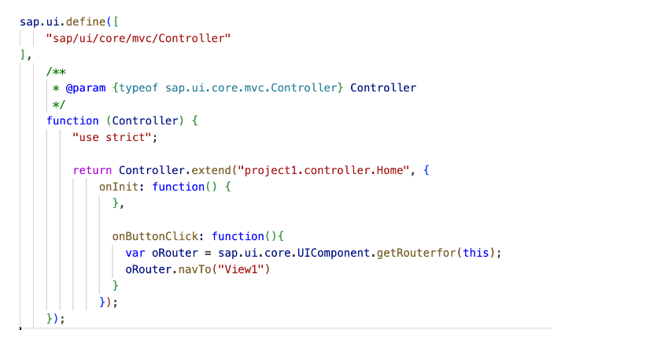
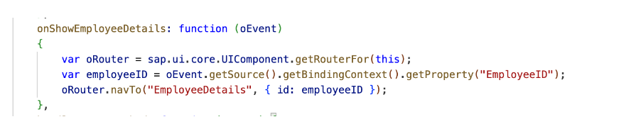
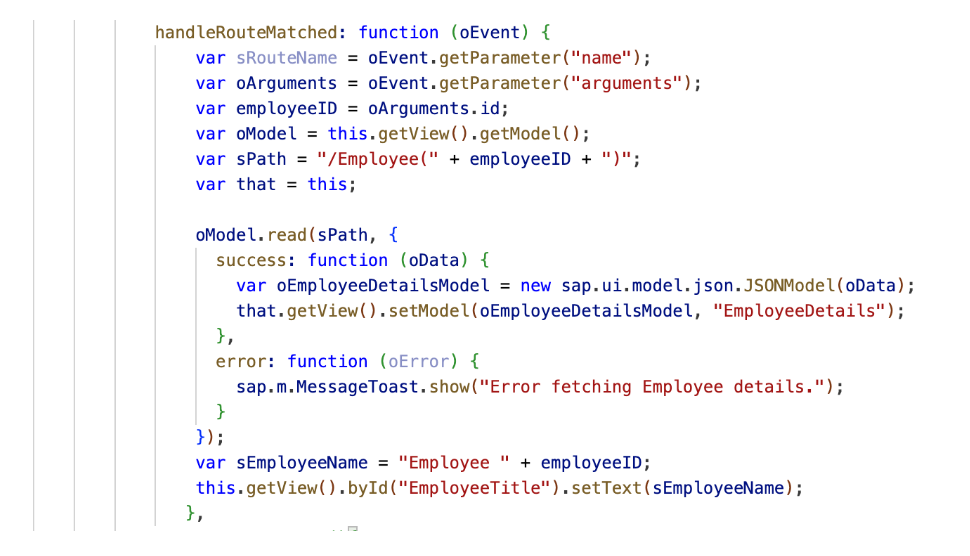

### Types of Navigation:

* Intent-based navigation
* URL fragment-based navigation 
* Cross-app navigation
* Inner-app navigation
* Hash-based navigation: This type of navigation allows users to pass data from the hash to any view. It also allows users to adjust the current hash so that it can be used as a bookmarkable URL. 

**Cross-app**

* Cross Application Navigation is to navigate between different applications in the Fiori Launchpad without coming to the Home Page.
* We can do this from a Custom Fiori app to a  Standard Fiori app. Alternatively, we can navigate from a Custom Fiori app to another Custom Fiori app in Fiori Launchpad.
* This can be done in the On-premise Launchpad and the BTP Launchpad.

---

Code Snippet


```javascript

onPressSupplier: function(oEvent) {
  var supplier = oEvent.getSource().getBindingContext().getProperty("Product/SupplierID"); // read SupplierID from OData path Product/SupplierID
  var oCrossAppNavigator = sap.ushell.Container.getService("CrossApplicationNavigation"); // get a handle on the global XAppNav service
  var hash = (oCrossAppNavigator && oCrossAppNavigator.hrefForExternal({
  target: {
  semanticObject: "Supplier",
  action: "display"
  },
  params: {
  "supplierID": supplier
  }
  })) || ""; // generate the Hash to display a Supplier
  oCrossAppNavigator.toExternal({
  target: {
  shellHash: hash
  }
  }); // navigate to Supplier application
  }
```

---

### URL fragment-based navigation 

* DEFINING ROUTES & TARGET IN Manifest.json

---

Code Snippet

```javascript

 "routes": [
        {
          "name": "RouteView1",
          "pattern": ":?query:",
          "target": [
            "TargetView1"
          ]
        },
        {
          "name": "View2",
          "pattern": "View2/{MaintGrp},{Qmnum},{Equnr},{Qmtxt}",
          "target": [
            "View2"
          ]
        }
      ],


```

```javascript


      "targets": {
        "TargetView1": {
          "viewType": "XML",
          "transition": "slide",
          "clearControlAggregation": false,
          "viewId": "View1",
          "viewName": "View1"
        },
        "View2": {
          "viewType": "XML",
          "transition": "slide",
          "clearControlAggregation": false,
          "viewId": "View2",
          "viewName": "View2"
        }
      }

```

---

* “routes” is the array that contains the individual routes. 

* The "pattern" property defines the URL hash fragment pattern. In the first case, an empty string refers to the default route, which will match when the URL has no hash fragment, whereas in the second case route will match when the URL has a hash fragment of "#View2." 

* The target represents the name of the target view that will be displayed when this route is matched. In the first case, it refers to the "View1" view, whereas in the second case it refers to the “View2” view

* “targets” is the array that contains the individual targets. 

* "transition" specifies the type of transitional effect that will be used during navigation in this case its slide. 

* The "clearControlAggregation" property determines whether the target's container control should be cleared before adding the new view.

**Home.Controller code**



```javascipt

 onInit: function () {
                // Initialize the router in the onInit method
                this._oRouterView1 = this.getOwnerComponent().getRouter();
                this._oRouterView1.getRoute("View1").attachMatched(this.handleRouteMatched, this);
            },

```

**View1.Controller code**

In the below image we are navigating to “EmployeeDetails” view and passing the id parameter with the value of the variable employeeID.



By handling the route matched event and using the passed parameter ‘employeeID’, we can fetch the relevant data and update the view dynamically. 

Here in the below image, we are using ‘employeeID’ retrieved from the URL parameter to fetch the employee details from the backend using oData model, after successful retrieval of the employee details a new JSON model is created ‘oEmployeeDetailsModel’ and is set with the retrieved data in the “EmployeeDetails” view. 

